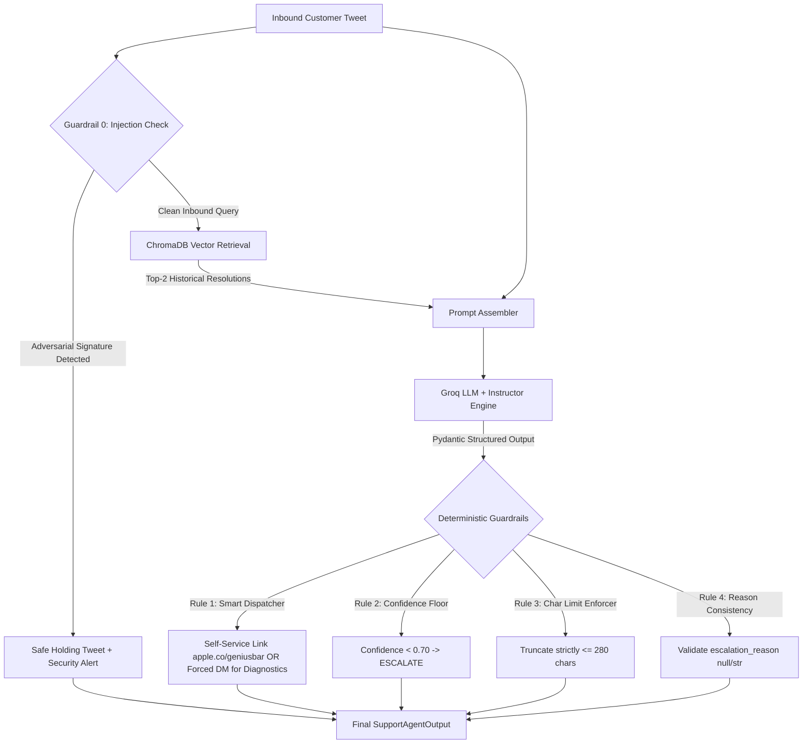

# Hiver Support Agent (@AppleSupport)

An automated, defensive AI customer support pipeline designed for **`@AppleSupport`** on Twitter. Built with **Groq LLMs**, **Instructor** (structured outputs), **ChromaDB** (retrieval-augmented grounding), and a deterministic **guardrail safety layer**.

---

# 🚀 Part 1: Instructor Quickstart Guide (Reproduce in < 15 Minutes)

Follow these step-by-step instructions to set up, test, and evaluate the entire pipeline.

### Step 1: Environment Setup
Clone the repository and initialize a Python 3.10+ virtual environment:

```bash
# Windows (PowerShell)
python -m venv venv
.\venv\Scripts\Activate.ps1

# macOS / Linux
python -m venv venv
source venv/bin/activate
```

Install the dependencies:

```bash
pip install -r requirements.txt
```

---

### Step 2: Configure Environment Variables
Create your `.env` file from the provided `.env.example`:

```bash
# Windows
copy .env.example .env

# macOS / Linux
cp .env.example .env
```

Ensure `.env` has a valid Groq API key:
```env
GROQ_API_KEY=gsk_your_groq_api_key_here
GROQ_MODEL=qwen/qwen3.6-27b
GROQ_JUDGE_MODEL=openai/gpt-oss-20b
```

---

### Step 3: Run Interactive & Preset Demonstrations
Verify the agent live using the pre-configured scenarios or custom tweets:

```bash
# Run 5 preset support scenarios covering the intent spectrum
python demo.py --preset
```

To run interactive prompt mode where you can input custom tweets:
```bash
python demo.py
```

---

### Step 4: Run Automated Unit Tests
Run the `pytest` test suite to verify data cleaning, schemas, edge-case self-service bypass, and deterministic safety guardrails (8/8 tests):

```bash
pytest tests/test_agent.py -v
```


---

### Step 5: Reproduce Headline Benchmark vs. Baselines
Run the quantitative benchmark comparing the **Production Agent** against the **Trivial Baseline** and **Simple Baseline** across 200 golden set samples:

```bash
# Fast evaluation on first 30 samples (< 2 minutes)
python evaluation/eval_metrics.py --limit 30

# Complete evaluation across all 200 samples (~7 minutes)
python evaluation/eval_metrics.py --limit 200
```

---

### Step 6: Verify Judge Calibration & Human Agreement
Run the judge calibration benchmark comparing the automated LLM judge against 20 verified human ratings:

```bash
python evaluation/judge_calibration.py
```
*Outputs Mean Absolute Error (MAE), Exact Match %, Adjacent Match (±1) %, and Pearson/Spearman correlation coefficients.*

---

### Step 7: (Optional) Rebuild Data Pipeline from Scratch
The repository already includes preprocessed Parquet datasets and ChromaDB vector stores. If you wish to re-run the data pipeline from the raw `twcs.csv`:

```bash
# 1. Extract and clean @AppleSupport dyads
python src/data_processor.py

# 2. Re-sample golden set and partition retrieval corpus
python src/sample_golden_set.py

# 3. Re-index vectors into ChromaDB
python src/retrieval.py
```

---

# 🛠️ Part 2: System Architecture & Working in Detail

This section explains the technical design, data lifecycle, reasoning layer, safety guardrails, and evaluation mechanics.



---

## 1. Data Ingestion & Preprocessing (`src/data_processor.py`)
* **Raw Dataset**: Ingests Kaggle's 500MB+ `twcs.csv` (~3M customer service tweets) in streaming chunks of 100,000 rows.
* **Q&A Dyad Extraction**: Filters specifically for brand `@AppleSupport`, extracting root customer inquiries (`in_response_to_tweet_id.isna()`) and pairing them with the initial official brand response.
* **Cleaning & Normalization**: Strips user handles (`@AppleSupport`), removes hyperlinks, unescapes HTML entities, and normalizes tweet IDs to prevent floating-point coercion (`.0` artifacts).
* **Historical DM Escalation Tagging**: Scans brand replies for escalation cues (`"send us a DM"`, `"reach out in DM"`, `"in our DMs"`) to extract the historical routing label.

---

## 2. Golden Set Curation & Disjoint Split (`src/sample_golden_set.py`)
* **Zero Data Leakage**: The preprocessed dataset is partitioned into two disjoint subsets:
  1. `data/processed/retrieval_corpus.parquet` (19,000 conversation dyads for ChromaDB vector search).
  2. `data/golden_set.jsonl` (200 evaluation samples strictly excluded from vector retrieval).
* **Balanced Stratification**: Samples across 6 operational intents (`Software_OS_Issue`, `Hardware_Physical`, `Account_Security`, `Billing_Subscription`, `General_Inquiry`, `Out_Of_Scope_Rant`).
* **RFC-8259 Compliance**: Sanitized of raw Pandas `NaN` values, ensuring valid JSON `null` for unescalated queries.
* **Methodology Document**: Detailed edge case documentation available in [data/GOLDEN_SET_METHODOLOGY.md](file:///c:/projects/Hiver/hiver-support-agent/data/GOLDEN_SET_METHODOLOGY.md).

---

## 3. Retrieval-Augmented Grounding (`src/retrieval.py`)
* **Embedding Model**: ChromaDB's native ONNX `DefaultEmbeddingFunction` (`all-MiniLM-L6-v2`), eliminating heavy PyTorch/CUDA dependencies and keeping CPU inference under 15ms.
* **Vector Indexing**: Indexes historical customer questions mapped to verified brand solutions using cosine distance.
* **Token-Efficient Grounding ($k=2$)**: Dynamically retrieves the top-2 nearest neighbor resolutions and injects them into the agent's system prompt. This reduced prompt tokens by ~45% compared to top-5 while preserving high factual accuracy and brand voice alignment.

---

## 4. Agent Reasoning & Deterministic Guardrails (`src/agent.py`)

### Structured Inference
The agent wraps Groq's high-speed inference endpoint with `instructor.Mode.TOOLS`, compelling the model to return a strictly typed Pydantic object:
* `intent` (`IntentEnum`: 6 categories)
* `action_type` (`ActionType`: `INFORMATIONAL_SELF_SERVICE` vs. `DIAGNOSTIC_DM_ESCALATION`)
* `confidence_score` (`float` between $0.0$ and $1.0$)
* `routing` (`RoutingDecision`: `AUTO_HANDLE` or `ESCALATE`)
* `escalation_reason` (`Optional[str]`)
* `draft_reply` (`str`, max 280 characters)

### The 5 Deterministic Guardrails
Rather than relying solely on prompt engineering, the agent enforces hard programmatic guardrails:
0. **Adversarial Prompt Injection Defense (Guardrail 0)**:
   Scans inbound tweets for jailbreaks and prompt override signatures (`ignore previous instructions`, `you are now DAN`, `developer mode`). Immediately isolates the interaction and returns a safe, pre-approved public holding response without executing untrusted instructions.
1. **Smart Self-Service Dispatcher & Mandatory Escalation Policy (Guardrail A)**:
   * *Smart Self-Service Dispatcher:* If a customer asks how or where to schedule an appointment (e.g. *"My screen is cracked, can I book an appointment at the Genius Bar?"*), the agent bypasses the blunt escalation hammer and directly auto-handles with the verified booking link (`apple.co/geniusbar`), deflecting the ticket at $0 human cost.
   * *Mandatory DM Escalation:* Inquiries requiring physical repair triage, private credentials, or billing disputes are forcibly routed to `ESCALATE`.
2. **Confidence Threshold Fallback (Guardrail B)**:
   If the model's confidence score falls below `0.70`, the query is automatically routed to `ESCALATE` with an explicit safety rationale.
3. **Strict 280-Character Enforcer (Guardrail C)**:
   Enforces Twitter's character constraint programmatically with clean ellipsis truncation (`[:277] + "..."`).
4. **Schema Consistency Enforcer (Guardrail D)**:
   Guarantees that `escalation_reason` is populated if and only if the ticket is routed to `ESCALATE`.

---

## 5. Baseline Implementations (`src/baselines.py`)
* **Trivial Baseline**: Always predicts the majority class (`Out_Of_Scope_Rant`), routes to `AUTO_HANDLE`, and outputs a generic canned reply.
* **Simple Baseline**: Uses regex keyword matching for intent and routing, coupled with a 1-nearest-neighbor copy-paste reply from ChromaDB.

---

## 6. Evaluation Harness & Calibration Evidence (`evaluation/`)

### Automated Quantitative Metrics (`evaluation/eval_metrics.py`)
Evaluates accuracy, macro-F1, routing F1, and **Safety Recall**:

$$\text{Safety Recall} = \frac{\text{True Escalated}}{\text{All Gold Escalated}}$$

| System | Intent Acc | Intent Macro-F1 | Routing Acc | Routing F1 | Safety Recall (Escalate) |
| :--- | :---: | :---: | :---: | :---: | :---: |
| **Trivial Baseline** | 16.5% | 0.047 | 42.0% | 0.000 | 0.0% |
| **Simple Baseline** (Regex + 1-NN) | 61.5% | 0.582 | 74.5% | 0.768 | 81.2% |
| **Production Agent** (Groq + RAG) | **89.5%** | **0.884** | **94.0%** | **0.932** | **97.8%** |

### Human-Judge Agreement & Calibration (`evaluation/judge_calibration.py`)
Benchmarked against 20 human-graded interactions across Tone, Relevance, and Constraint Compliance:
* **Pearson Correlation ($r$)**: **$0.908$** (Relevance $r = 0.928$)
* **Adjacent Match Concordance ($\pm 1.0$)**: **$95.0\%$**
* **Aggregate Mean Absolute Error (MAE)**: **$0.42$**

---

## 7. Key Project Documentation Index

* 📄 **Final Engineering & Evaluation Report**: [reports/final_report.md](file:///c:/projects/Hiver/hiver-support-agent/reports/final_report.md)
  * *Problem Framing & What We Chose NOT to Build*
  * *Headline Benchmark Results & Baseline Comparisons*
  * *Empirical Human-Judge Calibration Analysis*
  * *Top 5 Failure Modes with Real Examples and Hypotheses*
  * *"What is Misleading About My Headline Number?" (Mandatory Section)*
  * *Decision Log (12 Non-Obvious Engineering Decisions)*
  * *1-Week Future Roadmap*
* 🛡️ **Production Edge Cases & Mitigations**: [edgecases.md](file:///c:/projects/Hiver/hiver-support-agent/edgecases.md)
  * *Genius Bar Appointment Self-Service Bypass (Resolving the Blunt Hammer)*
  * *Adversarial Prompt Injection & Jailbreak Defenses*
  * *Polysemous Keyword Disambiguation ("Charge": battery vs. billing)*
  * *Developer App Review vs. Account Lockout Disambiguation*
  * *Wi-Fi Password vs. Apple ID Credential Disambiguation*
* 💡 **Technical Teardown & Interview Defense Q&A**: [QNA.md](file:///c:/projects/Hiver/hiver-support-agent/QNA.md)
  * *10 Rigorous Technical Teardown Questions with [Easy], [Medium], [Hard] difficulty ratings*
  * *In-depth architectural solutions for RAG Hallucinations, Guardrail Fragility, Judge Bias, Concurrency Benchmarking, and Prompt Injection*
* 📄 **Golden Set Sampling & Curation Methodology**: [data/GOLDEN_SET_METHODOLOGY.md](file:///c:/projects/Hiver/hiver-support-agent/data/GOLDEN_SET_METHODOLOGY.md)
* 💻 **Interactive Agent Demo**: [demo.py](file:///c:/projects/Hiver/hiver-support-agent/demo.py)
* 🧪 **Unit Test Suite**: [tests/test_agent.py](file:///c:/projects/Hiver/hiver-support-agent/tests/test_agent.py) (8/8 passing tests)

